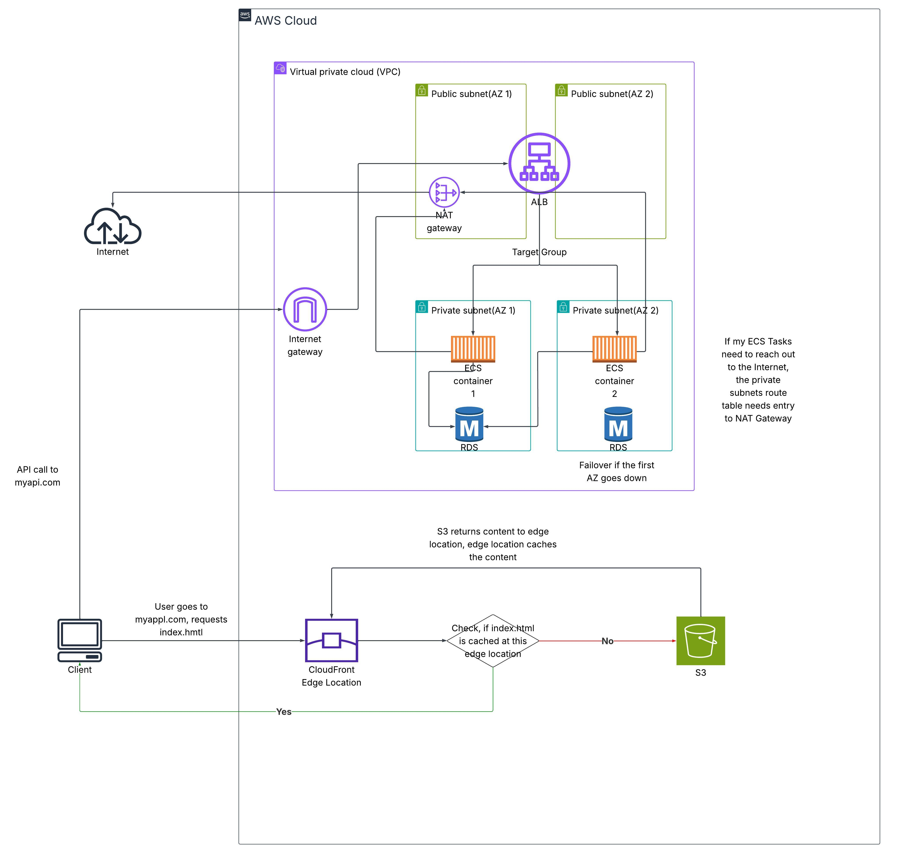

# Terraform Three-Tier Application on AWS

A production-style **three-tier architecture on AWS**, provisioned end-to-end with
**Terraform** and deployed through **GitHub Actions**. The application tier runs on
**ECS Fargate** across two Availability Zones, with a Multi-AZ **RDS** database and a
**CloudFront + S3** frontend — infrastructure, image builds, and deployment fully
automated, with no manual steps in the AWS console.



---

## Architecture

The stack follows the classic three-tier separation, spread across two Availability
Zones for high availability:

- **Presentation tier** — a static frontend hosted in **S3** and served through
  **CloudFront**. Requests to the app hit a CloudFront edge location; on a cache miss
  the content is fetched from S3, cached at the edge, and returned to the client.
- **Application tier** — containerized services on **ECS Fargate**, running in
  **private subnets** across two AZs. An **Application Load Balancer** in the public
  subnets distributes traffic to the ECS tasks via a target group. Images are stored in
  **Amazon ECR**.
- **Data tier** — **Amazon RDS** in the private subnets, with a standby in the second
  AZ for failover if the primary AZ becomes unavailable.

**Networking:** The VPC is split into public and private subnets per AZ. The
**Internet Gateway** handles inbound traffic to the public subnets; the **NAT Gateway**
lets ECS tasks in the private subnets reach the internet for outbound traffic (e.g.
pulling images or calling external services) without being publicly reachable
themselves. The database and application tiers have no direct internet exposure.

---

## Stack

| Layer | Technology |
|---|---|
| IaC | Terraform (HCL) |
| Compute | AWS ECS Fargate (multi-AZ) |
| Load balancing | Application Load Balancer + target group |
| Frontend delivery | CloudFront + S3 |
| Database | Amazon RDS (Multi-AZ failover) |
| Container registry | Amazon ECR |
| Networking | VPC, public/private subnets, Internet Gateway, NAT Gateway |
| State management | Remote state in **S3**, locking via **DynamoDB** |
| CI/CD | GitHub Actions |
| Application | Java backend, TypeScript/React frontend |

---

## Repository layout

```
.
├── .github/workflows/     CI/CD pipelines (see below)
├── backend/               Java application + Dockerfile
├── frontend/              TypeScript/React application
├── infra/                 Terraform configuration (VPC, ECS, ALB, RDS, ECR, ...)
└── three_tier_app.jpeg    Architecture diagram
```

---

## CI/CD pipelines

The project uses **three GitHub Actions workflows**, separating application delivery
from infrastructure changes:

**1. Backend image build & push**(.github/workflows/build-deploy-backend.yml) — builds the backend container image and pushes it to
Amazon ECR.

**2. Frontend image build & push**(.github/workflows/build-deploy-frontend.yml) — builds the frontend image and pushes it to Amazon
ECR.

**3. Terraform lifecycle**(.github/workflows/terraform-infra.yml) — runs `terraform init`, `plan`, and `apply` for the
infrastructure in `infra/`.

Splitting application builds from the Terraform lifecycle keeps infrastructure changes
reviewable in isolation and avoids rebuilding images on every infrastructure change —
see [Design decisions](#design-decisions)

---

## Remote state

Terraform state is stored remotely in an **S3 bucket**, with a **DynamoDB table** for
state locking. This prevents concurrent `apply` runs from corrupting state and lets the
same infrastructure be managed both from CI and locally — the standard approach for any
Terraform project beyond a single-developer experiment.

```hcl
# infra/backend.tf  (example — adjust to your actual values)
terraform {
  backend "s3" {
    bucket         = "my-terraform-state-bucket"
    key            = "three-tier-app/terraform.tfstate"
    region         = "eu-central-1"
    dynamodb_table = "terraform-state-lock"
    encrypt        = true
  }
}
```

---

## Getting started

### Prerequisites

- Terraform
- AWS CLI, configured with credentials
- An existing S3 bucket and DynamoDB table for remote state (see above)

### Provision the infrastructure

```bash
cd infra
terraform init
terraform plan
terraform apply
```

### Deploy the application

Application images are built and pushed to ECR automatically by the GitHub Actions
workflows on changes to `backend/` or `frontend/`. To build locally instead:

```bash
# example — adjust to your ECR repo URIs
docker build -t <account>.dkr.ecr.<region>.amazonaws.com/backend:latest backend/
docker push  <account>.dkr.ecr.<region>.amazonaws.com/backend:latest
```

---

## What this demonstrates

- **Infrastructure as Code** — the entire AWS environment is defined in Terraform and
  reproducible from scratch, with no manual console steps
- **High availability by design** — application and data tiers span two Availability
  Zones, with RDS failover and load-balanced ECS tasks
- **Network isolation** — public-facing load balancing and NAT in public subnets;
  application and database tiers in private subnets with no direct internet exposure
- **Remote state with locking** — S3 for storage, DynamoDB for concurrency safety,
  enabling CI-driven `apply`
- **Container-based deployment** — images built in CI, stored in ECR, run on ECS Fargate
- **Edge-cached content delivery** — static frontend served via CloudFront to reduce
  latency and offload S3
- **Separation of concerns in CI/CD** — application builds and infrastructure changes in
  independent workflows

---

## Design decisions

**ECS Fargate instead of EC2.**
Fargate removes the need to provision, patch, and scale EC2 instances for the container
workload, keeping the operational surface minimal and letting AWS handle the underlying
compute — a reasonable trade-off for a small, stateless application tier.

**Multi-AZ across the board.**
ECS tasks run in two AZs behind the load balancer, and RDS is configured with a standby
in the second AZ. If one AZ fails, both the application and database tiers continue to
serve — the single most important property of a "production-style" architecture.

**Private subnets with a NAT Gateway for egress.**
The application and database tiers are never directly reachable from the internet.
Outbound access (e.g. pulling dependencies) goes through the NAT Gateway, so tasks can
reach out while remaining unreachable from outside.

**CloudFront in front of S3 for the frontend.**
Serving static assets from an S3 origin through CloudFront edge locations reduces
latency for end users and takes read load off the origin — the standard pattern for
static SPA delivery.

**Remote state from day one.**
Even for a solo project, local state would block running `terraform apply` from CI and
risk conflicts. S3 + DynamoDB locking mirrors real-world team practice.

**Separate build and infrastructure workflows.**
Application code changes far more often than infrastructure. Keeping image builds
separate from the Terraform lifecycle means an infrastructure review isn't cluttered
with application diffs, and a code change doesn't trigger a `terraform plan`.

--

## Notes

A personal reference project built to demonstrate an end-to-end, highly available AWS
three-tier deployment with Terraform and GitHub Actions.
